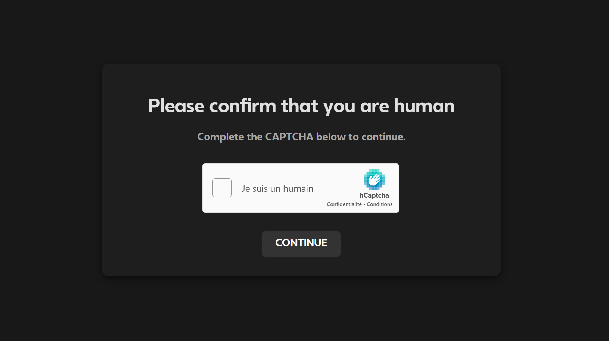
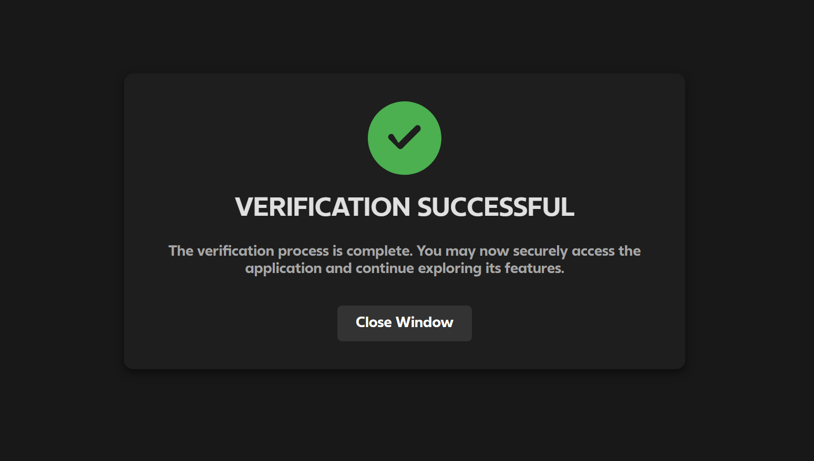

# PHP-AntibotsProject
The **PHP-AntibotsProject** is a powerful antibot solution designed to safeguard websites from automated bots and unauthorized users. It integrates advanced security measures such as CAPTCHA verification, IP filtering, and user-agent validation to ensure only legitimate traffic is granted access.

## Features

- **CAPTCHA Verification**: Ensures the visitor is a human by using hCaptcha.
- **IP Blocking**: Automatically blocks known malicious IP addresses and ranges.
- **User-Agent Validation**: Filters access based on suspicious user agents.
- **Hostname Filtering**: Blocks visitors coming from suspicious hostnames.
- **Country and Region Restriction**: Allows access only from specified countries and regions.
- **Proxy and VPN Detection**: Restricts access from proxies and VPNs to ensure genuine users.
- **Customizable Configuration**: Easily modify settings to adapt the project to your needs.
- **Default Landing Page Redirection**: Redirects blocked users to a predefined URL.

## Screenshots
**1. Human Verification CAPTCHA Interface**



**2. Verification Success Screen**



## How It Works

1. **Initial Request Filtering**:
   - The system checks the visitor's IP address, user agent, and hostname against the predefined blacklists.
   - If any match is found, the visitor is blocked and redirected.

2. **CAPTCHA Verification**:
   - Visitors passing the initial filtering step are presented with a CAPTCHA.
   - Upon successful completion, they are granted access to the site.

3. **Configuration-Based Control**:
   - Access is further restricted based on country and region settings.

## Configuration

All configuration settings are defined in the `config.php` file:

```php
return [
    'mobile_only' => false, // Enable mobile-only access
    'allow_countries' => ['CA', 'FR', 'US'], // List of allowed countries (ISO codes)
    'allow_regions' => ['Quebec'], // List of allowed regions
    'block_proxies' => true, // Block proxy and VPN connections
    'verify_user_agent' => true, // Validate User-Agent strings
    'captcha_enabled' => true // Enable CAPTCHA verification
];
```

### Key Settings

- **`mobile_only`**: Restrict access to mobile devices.
- **`allow_countries`**: Specify the list of allowed countries.
- **`allow_regions`**: Add specific regions for enhanced control.
- **`block_proxies`**: Enable or disable proxy detection.
- **`verify_user_agent`**: Choose whether to filter visitors based on user-agent strings.
- **`captcha_enabled`**: Toggle CAPTCHA verification.

## Installation

1. Clone the repository:
   ```bash
   git clone https://github.com/yourusername/PHP-AntibotsProject.git
   ```

2. Navigate to the project directory:
   ```bash
   cd PHP-AntibotsProject
   ```

3. Configure your settings in `config.php`.

4. Deploy the project to your PHP-enabled web server.

## Customization

1. **Add or Modify Blocked IPs**:
   - Edit the `disallowedIPs` array in the `ips.php` file.

2. **Update Blocked User Agents**:
   - Modify the `disallowedUserAgents` array in the `useragents.php` file.

3. **Change Hostname Filtering**:
   - Add or update entries in the `blockedHostnames` array in the `hostnames.php` file.

4. **Redirect Verified Users**:
   - Update the redirection URL in the `detect.php` file.

## Usage

- Deploy the project on your server.
- Ensure the `config.php` file is configured to meet your requirements.
- Access the website as a user and observe the antibot protection in action.

## Example Workflow

1. A visitor tries to access the website.
2. The system performs initial checks (IP, user agent, hostname).
3. If passed, the visitor is shown a CAPTCHA verification.
4. On successful verification, the visitor is granted access to the site.
5. If verification fails or criteria are not met, the visitor is blocked or redirected.

## Live Demo

Try the live version [here](https://your-website.com).

## License

This project is licensed under the MIT License. See the LICENSE file for details.

## Author

Developed by Akramway00.


